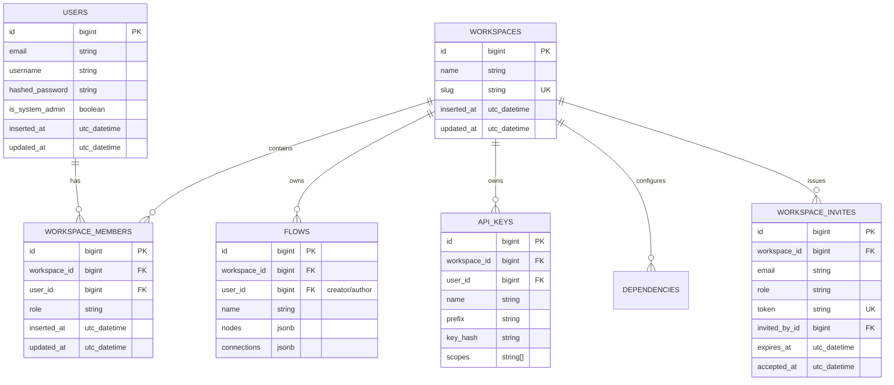
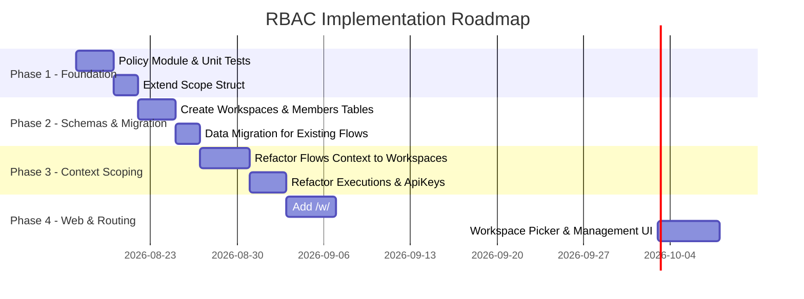

# Role-Based Access Control (RBAC) & Multi-Tenancy Architecture

## 1. Executive Summary

This document specifies the architectural design, domain model, policy engine, and implementation roadmap for **Workspace-Scoped Role-Based Access Control (RBAC)** in FusionFlow.

FusionFlow is transitioning from a single-tenant/user-ownership model to a **multi-tenant workspace architecture**. Users can belong to multiple workspaces with distinct roles and permissions in each.

### Core Principles
1. **Separation of Concerns (Tenancy vs. Authorization)**:
   - **Tenancy**: Ensures that data queries are strictly scoped by `workspace_id`. A user with valid permissions in Workspace A can **never** access or mutate data in Workspace B.
   - **Authorization**: Determines what actions a user is permitted to perform within their active workspace.
2. **Centralized Policy Engine (`FusionFlowCore.Policy`)**:
   - Single source of truth for role-to-permission mapping and authorization checks.
3. **Explicit Context Scopes (`FusionFlowCore.Accounts.Scope`)**:
   - Permissions are resolved once per request/mount and carried inside the immutable `%Scope{}` struct.
4. **Defense in Depth**:
   - Context modules enforce authorization rules via `Policy.authorize/2` in `with` pipelines.
   - UI layers (LiveViews, Templates, Components) use `Policy.can?/2` solely for UX enhancements (hiding buttons, disabling inputs, route guards).
   - Non-authorized actions fail securely at the domain layer, returning `{:error, :unauthorized}` (HTTP 403).
5. **No Existence Leakage**:
   - Workspace resolution uses an atomic query combining workspace existence and user membership. Unauthorized users receive a generic `404 Not Found`, preventing workspace enumeration.

---

## 2. Domain Model & Database Schema



### 2.1. Schemas

#### `FusionFlowCore.Workspaces.Workspace`
```elixir
defmodule FusionFlowCore.Workspaces.Workspace do
  use Ecto.Schema
  import Ecto.Changeset

  schema "workspaces" do
    field :name, :string
    field :slug, :string

    has_many :memberships, FusionFlowCore.Workspaces.Member
    has_many :users, through: [:memberships, :user]
    has_many :flows, FusionFlowCore.Flows.Flow
    has_many :api_keys, FusionFlowCore.ApiKeys.ApiKey

    timestamps(type: :utc_datetime)
  end

  @doc false
  def changeset(workspace, attrs) do
    workspace
    |> cast(attrs, [:name, :slug])
    |> validate_required([:name, :slug])
    |> validate_format(:slug, ~r/^[a-z0-9]+(?:-[a-z0-9]+)*$/, message: "must be lowercase alphanumeric with hyphens")
    |> validate_length(:slug, min: 3, max: 48)
    |> unique_constraint(:slug)
  end
end
```

#### `FusionFlowCore.Workspaces.Member`
```elixir
defmodule FusionFlowCore.Workspaces.Member do
  use Ecto.Schema
  import Ecto.Changeset

  @roles ~w(owner admin editor viewer)

  schema "workspace_members" do
    field :role, :string, default: "viewer"

    belongs_to :workspace, FusionFlowCore.Workspaces.Workspace
    belongs_to :user, FusionFlowCore.Accounts.User

    timestamps(type: :utc_datetime)
  end

  def roles, do: @roles

  @doc false
  def changeset(member, attrs) do
    member
    |> cast(attrs, [:role, :workspace_id, :user_id])
    |> validate_required([:role, :workspace_id, :user_id])
    |> validate_inclusion(:role, @roles)
    |> foreign_key_constraint(:workspace_id)
    |> foreign_key_constraint(:user_id)
    |> unique_constraint([:workspace_id, :user_id], name: :workspace_members_workspace_id_user_id_index)
  end
end
```

---

## 3. Scope Model (`FusionFlowCore.Accounts.Scope`)

The `%Scope{}` struct travels through plugs, LiveView socket assigns, and context functions as the canonical caller context.

```elixir
defmodule FusionFlowCore.Accounts.Scope do
  @moduledoc """
  Carries identity, workspace context, and derived permissions for authorization and multi-tenancy.
  """

  alias FusionFlowCore.Accounts.User
  alias FusionFlowCore.ApiKeys.ApiKey
  alias FusionFlowCore.Workspaces.{Member, Workspace}
  alias FusionFlowCore.Policy

  @enforce_keys [:user]
  defstruct [
    :user,
    :workspace,
    :member,
    :role,
    api_key: nil,
    api_scopes: [],
    permissions: MapSet.new(),
    is_system_admin: false
  ]

  @type t :: %__MODULE__{
          user: User.t() | nil,
          workspace: Workspace.t() | nil,
          member: Member.t() | nil,
          role: atom() | nil,
          api_key: ApiKey.t() | nil,
          api_scopes: list(String.t()),
          permissions: MapSet.t(atom()),
          is_system_admin: boolean()
        }

  @doc """
  Builds a scope for an unauthenticated session or general user without active workspace.
  """
  def for_user(%User{is_system_admin: is_admin} = user) do
    %__MODULE__{
      user: user,
      is_system_admin: is_admin,
      permissions: if(is_admin, do: Policy.all_permissions(), else: MapSet.new())
    }
  end

  def for_user(nil), do: nil

  @doc """
  Builds a scope for an authenticated user inside a specific workspace membership.
  """
  def for_membership(%User{is_system_admin: is_admin} = user, %Workspace{} = workspace, %Member{role: role} = member) do
    role_atom = String.to_existing_atom(role)

    permissions =
      if is_admin do
        Policy.all_permissions()
      else
        Policy.permissions_for(role_atom)
      end

    %__MODULE__{
      user: user,
      workspace: workspace,
      member: member,
      role: role_atom,
      is_system_admin: is_admin,
      permissions: permissions
    }
  end

  @doc """
  Builds a scope for an API Key associated with a workspace.
  """
  def for_api_key(%ApiKey{workspace: %Workspace{} = workspace, user: user, scopes: scopes} = api_key) do
    %__MODULE__{
      user: user,
      workspace: workspace,
      api_key: api_key,
      api_scopes: scopes || [],
      role: :api_token,
      permissions: Policy.permissions_for_api_scopes(scopes || []),
      is_system_admin: false
    }
  end
end
```

---

## 4. Role & Permission Matrix (`FusionFlowCore.Policy`)

### 4.1. Defined Roles
- **`:owner`**: The creator/owner of the workspace. Has full access, including member management, workspace deletion, and ownership transfer.
- **`:admin`**: Manages workspace configuration, members (except owner), API keys, and all flow operations.
- **`:editor`**: Can create, edit, save, and run flows, configure dependencies, and view execution history.
- **`:viewer`**: Read-only access to flows, executions, and logs. Cannot modify canvas or trigger executions.
- **`:system_admin`** (Platform Operator): Bypasses workspace checks for support and maintenance.

### 4.2. Permission Atoms

| Domain | Permission Atom | Description |
| :--- | :--- | :--- |
| **Workspace** | `:view_workspace` | View workspace dashboard and general info |
| | `:manage_workspace` | Edit workspace name and general settings |
| | `:delete_workspace` | Delete workspace and all attached data |
| | `:transfer_ownership` | Transfer workspace ownership to another member |
| **Members** | `:view_members` | List members and pending invitations |
| | `:invite_members` | Send membership invitations |
| | `:manage_members` | Change member roles or remove members |
| **Flows** | `:view_flows` | Read and inspect flow graphs |
| | `:create_flows` | Create new workflow records |
| | `:edit_flows` | Update canvas nodes, connections, and metadata |
| | `:delete_flows` | Delete workflow records |
| | `:execute_flows` | Trigger manual runs or webhook simulations |
| **Executions** | `:view_executions` | View execution runs, results, and debug logs |
| | `:cancel_executions` | Cancel in-flight Oban workflow execution jobs |
| **API Keys** | `:view_api_keys` | View registered API key prefixes and scopes |
| | `:manage_api_keys` | Generate new API keys or revoke existing keys |
| **Dependencies** | `:view_deps` | View installed hex/python package dependencies |
| | `:manage_deps` | Install or uninstall project dependencies |

### 4.3. Role-Permission Matrix

| Permission Atom | `:viewer` | `:editor` | `:admin` | `:owner` |
| :--- | :---: | :---: | :---: | :---: |
| `:view_workspace` | ✅ | ✅ | ✅ | ✅ |
| `:view_members` | ✅ | ✅ | ✅ | ✅ |
| `:view_flows` | ✅ | ✅ | ✅ | ✅ |
| `:view_executions` | ✅ | ✅ | ✅ | ✅ |
| `:view_deps` | ✅ | ✅ | ✅ | ✅ |
| `:view_api_keys` | ❌ | ❌ | ✅ | ✅ |
| `:create_flows` | ❌ | ✅ | ✅ | ✅ |
| `:edit_flows` | ❌ | ✅ | ✅ | ✅ |
| `:execute_flows` | ❌ | ✅ | ✅ | ✅ |
| `:manage_deps` | ❌ | ✅ | ✅ | ✅ |
| `:cancel_executions` | ❌ | ✅ | ✅ | ✅ |
| `:delete_flows` | ❌ | ❌ | ✅ | ✅ |
| `:invite_members` | ❌ | ❌ | ✅ | ✅ |
| `:manage_members` | ❌ | ❌ | ✅ | ✅ |
| `:manage_api_keys` | ❌ | ❌ | ✅ | ✅ |
| `:manage_workspace` | ❌ | ❌ | ✅ | ✅ |
| `:transfer_ownership` | ❌ | ❌ | ❌ | ✅ |
| `:delete_workspace` | ❌ | ❌ | ❌ | ✅ |

---

## 5. Policy Implementation (`FusionFlowCore.Policy`)

```elixir
defmodule FusionFlowCore.Policy do
  @moduledoc """
  Central authorization module for FusionFlow. Defines the role-permission matrix
  and evaluates permissions against a Scope.
  """

  alias FusionFlowCore.Accounts.Scope

  @viewer_permissions MapSet.new([
    :view_workspace,
    :view_members,
    :view_flows,
    :view_executions,
    :view_deps
  ])

  @editor_permissions MapSet.union(
    @viewer_permissions,
    MapSet.new([
      :create_flows,
      :edit_flows,
      :execute_flows,
      :cancel_executions,
      :manage_deps
    ])
  )

  @admin_permissions MapSet.union(
    @editor_permissions,
    MapSet.new([
      :delete_flows,
      :invite_members,
      :manage_members,
      :view_api_keys,
      :manage_api_keys,
      :manage_workspace
    ])
  )

  @owner_permissions MapSet.union(
    @admin_permissions,
    MapSet.new([
      :transfer_ownership,
      :delete_workspace
    ])
  )

  @all_permissions @owner_permissions

  @doc "Returns all permissions registered in the system."
  def all_permissions, do: @all_permissions

  @doc "Returns the MapSet of permissions for a given workspace role."
  @spec permissions_for(atom()) :: MapSet.t(atom())
  def permissions_for(:owner), do: @owner_permissions
  def permissions_for(:admin), do: @admin_permissions
  def permissions_for(:editor), do: @editor_permissions
  def permissions_for(:viewer), do: @viewer_permissions
  def permissions_for(_), do: MapSet.new()

  @doc "Maps API token scope strings to permission atoms."
  def permissions_for_api_scopes(scopes) do
    Enum.reduce(scopes, MapSet.new(), fn
      "flows:read", acc -> MapSet.put(acc, :view_flows)
      "flows:write", acc -> acc |> MapSet.put(:create_flows) |> MapSet.put(:edit_flows) |> MapSet.put(:delete_flows)
      "executions:read", acc -> MapSet.put(acc, :view_executions)
      "executions:write", acc -> MapSet.put(acc, :execute_flows)
      "nodes:read", acc -> MapSet.put(acc, :view_flows)
      _, acc -> acc
    end)
  end

  @doc """
  Evaluates whether the given Scope holds the specified permission.
  Platform administrators with `is_system_admin: true` always evaluate to `true`.
  """
  @spec can?(Scope.t() | nil, atom()) :: boolean()
  def can?(nil, _permission), do: false
  def can?(%Scope{is_system_admin: true}, _permission), do: true
  def can?(%Scope{permissions: permissions}, permission) do
    MapSet.member?(permissions, permission)
  end

  @doc """
  Authorizes an action, returning `:ok` or `{:error, :unauthorized}` for `with` pipelines.
  """
  @spec authorize(Scope.t() | nil, atom()) :: :ok | {:error, :unauthorized}
  def authorize(scope, permission) do
    if can?(scope, permission) do
      :ok
    else
      {:error, :unauthorized}
    end
  end
end
```

---

## 6. Context & Data Isolation Enforcement Pattern

### 6.1. Domain Context Enforcement (`FusionFlowCore.Flows`)

Every context function checks `Policy.authorize/2` AND enforces `workspace_id` scoping:

```elixir
defmodule FusionFlowCore.Flows do
  import Ecto.Query
  alias FusionFlowCore.{Policy, Repo}
  alias FusionFlowCore.Accounts.Scope
  alias FusionFlowCore.Flows.Flow

  @doc """
  Lists all flows in the active workspace.
  """
  def list_flows(%Scope{workspace: ws} = scope) when not is_nil(ws) do
    with :ok <- Policy.authorize(scope, :view_flows) do
      scope
      |> scope_query()
      |> Repo.all()
    end
  end

  @doc """
  Gets a flow by ID, strictly isolated to the scope's workspace.
  """
  def get_flow!(%Scope{workspace: ws} = scope, id) when not is_nil(ws) do
    with :ok <- Policy.authorize(scope, :view_flows) do
      scope
      |> scope_query()
      |> Repo.get!(id)
    end
  end

  @doc """
  Updates a flow with graph or metadata changes.
  """
  def update_flow(%Scope{workspace: ws} = scope, %Flow{} = flow, attrs) when not is_nil(ws) do
    with :ok <- Policy.authorize(scope, :edit_flows),
         true <- flow.workspace_id == ws.id || {:error, :not_found} do
      flow
      |> Flow.changeset(attrs)
      |> Repo.update()
    end
  end

  @doc """
  Deletes a flow.
  """
  def delete_flow(%Scope{workspace: ws} = scope, %Flow{} = flow) when not is_nil(ws) do
    with :ok <- Policy.authorize(scope, :delete_flows),
         true <- flow.workspace_id == ws.id || {:error, :not_found} do
      Repo.delete(flow)
    end
  end

  defp scope_query(%Scope{workspace: %{id: workspace_id}}) do
    from f in Flow, where: f.workspace_id == ^workspace_id
  end
end
```

---

## 7. Web & LiveView Integration

### 7.1. Routing with `/w/:workspace_slug`

All workspace-scoped pages are grouped under a dedicated route prefix `/w/:workspace_slug`:

```elixir
scope "/w/:workspace_slug", FusionFlowUI do
  pipe_through [:browser, :require_authenticated_user]

  live_session :workspace_scoped,
    on_mount: [
      {FusionFlowUI.UserAuth, :require_authenticated},
      {FusionFlowUI.WorkspaceAuth, :mount_workspace_scope}
    ] do
    live "/", DashboardLive.Index
    live "/flows", FlowLive.Index
    live "/flows/new/ai", FlowLive.AICreator
    live "/flows/:id", FlowLive.Editor
    live "/executions", ExecutionLive.Index
    live "/executions/:public_id", ExecutionLive.Index, :show
    live "/settings/members", WorkspaceLive.Members
    live "/settings/api-keys", ApiKeyLive.Index
    live "/settings/general", WorkspaceLive.Settings
  end
end

# Non-workspace pages (Global Account, Setup, Workspace Picker)
scope "/", FusionFlowUI do
  pipe_through [:browser, :require_authenticated_user]

  live_session :account_scoped,
    on_mount: [{FusionFlowUI.UserAuth, :require_authenticated}] do
    live "/workspaces", WorkspaceLive.Picker
    live "/workspaces/new", WorkspaceLive.New
    live "/users/settings", UserLive.Settings, :edit
  end
end
```

### 7.2. Safe Workspace Resolution (`WorkspaceAuth`)

```elixir
defmodule FusionFlowUI.WorkspaceAuth do
  import Phoenix.LiveView
  import Phoenix.Component
  alias FusionFlowCore.{Accounts.Scope, Workspaces}

  def on_mount(:mount_workspace_scope, %{"workspace_slug" => slug}, _session, socket) do
    user = socket.assigns.current_scope.user

    case Workspaces.fetch_member_workspace(user, slug) do
      {:ok, %{workspace: workspace, member: member}} ->
        scope = Scope.for_membership(user, workspace, member)
        {:cont, assign(socket, current_scope: scope, current_workspace: workspace)}

      {:error, :not_found} ->
        socket =
          socket
          |> put_flash(:error, "Workspace not found or access denied.")
          |> redirect(to: ~p"/workspaces")

        {:halt, socket}
    end
  end
end
```

### 7.3. Atomic Query in `Workspaces.fetch_member_workspace/2`

```elixir
defmodule FusionFlowCore.Workspaces do
  import Ecto.Query
  alias FusionFlowCore.Repo
  alias FusionFlowCore.Workspaces.{Member, Workspace}

  @doc """
  Fetches a workspace and the user's membership in a single atomic query.
  Returns {:error, :not_found} if either does not exist, preventing workspace enumeration.
  """
  def fetch_member_workspace(%{id: user_id, is_system_admin: true}, slug) do
    case Repo.get_by(Workspace, slug: slug) do
      nil -> {:error, :not_found}
      workspace -> {:ok, %{workspace: workspace, member: %Member{role: "owner"}}}
    end
  end

  def fetch_member_workspace(%{id: user_id}, slug) do
    query =
      from w in Workspace,
        join: m in Member,
        on: m.workspace_id == w.id and m.user_id == ^user_id,
        where: w.slug == ^slug,
        select: {w, m}

    case Repo.one(query) do
      {workspace, member} -> {:ok, %{workspace: workspace, member: member}}
      nil -> {:error, :not_found}
    end
  end
end
```

### 7.4. UI Conditional Rendering (`can?/2`)

In templates and LiveViews, `Policy.can?/2` controls UX visibility:

```heex
<%!-- Flow Header Save Button --%>
<%= if Policy.can?(@current_scope, :edit_flows) do %>
  <.button phx-click="save_graph" variant="primary">
    {gettext("Save Flow")}
  </.button>
<% end %>

<%!-- Flow Delete Button in Flow List --%>
<%= if Policy.can?(@current_scope, :delete_flows) do %>
  <.button phx-click="delete_flow" phx-value-id={flow.id} variant="danger">
    {gettext("Delete")}
  </.button>
<% end %>

<%!-- Workspace Settings Link in Sidebar --%>
<%= if Policy.can?(@current_scope, :manage_workspace) do %>
  <.link navigate={~p"/w/#{@current_workspace.slug}/settings/general"}>
    {gettext("Workspace Settings")}
  </.link>
<% end %>
```

---

## 8. Security & Edge Case Handling

### 8.1. Last Owner Protection
A workspace must **always** have at least one active owner.
- An owner cannot demote their own role or remove themselves if they are the sole owner.
- Attempting to delete the last owner returns `{:error, :cannot_remove_last_owner}`.

### 8.2. Privilege Escalation Prevention
- A member with `:manage_members` (e.g. `:admin`) can only grant roles up to their own level (`:viewer`, `:editor`, `:admin`).
- Only `:owner` can promote a member to `:owner` or transfer workspace ownership.

### 8.3. Session Invalidation on Role Revocation
- When a user is removed from a workspace or their role is modified, LiveView broadcasts a message on the topic `"workspace:#{workspace.id}:member:#{user.id}"` to trigger dynamic scope re-evaluation or forced navigation back to `/workspaces`.

---

## 9. Phased Implementation Roadmap



### Phase 1: Policy Foundation & Extended Scope
- Create `FusionFlowCore.Policy` with comprehensive unit tests for all roles and permissions.
- Extend `FusionFlowCore.Accounts.Scope` to support `:workspace`, `:member`, `:role`, and `:permissions`.

### Phase 2: Database Schemas & Data Migration
- Create migrations for `workspaces` and `workspace_members`.
- Add `workspace_id` foreign key columns to `flows`, `executions`, and `api_keys`.
- Migration script:
  - Generate a default workspace for each existing user (e.g., `"username-workspace"`).
  - Create a `:owner` `workspace_members` record for that user.
  - Populate `workspace_id` on all existing flows and API keys.

### Phase 3: Context Enforcement & Query Scoping
- Update `FusionFlowCore.Flows`, `Executions`, and `ApiKeys` functions to accept `%Scope{workspace: ws}` and enforce `Policy.authorize/2`.

### Phase 4: UI Namespacing & LiveView Authorization
- Introduce `/w/:workspace_slug` routes with `WorkspaceAuth` on-mount hook.
- Implement Workspace switcher component in the global sidebar.
- Implement Member Management LiveView (`/w/:workspace_slug/settings/members`).
